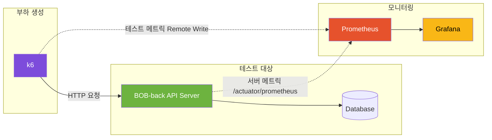
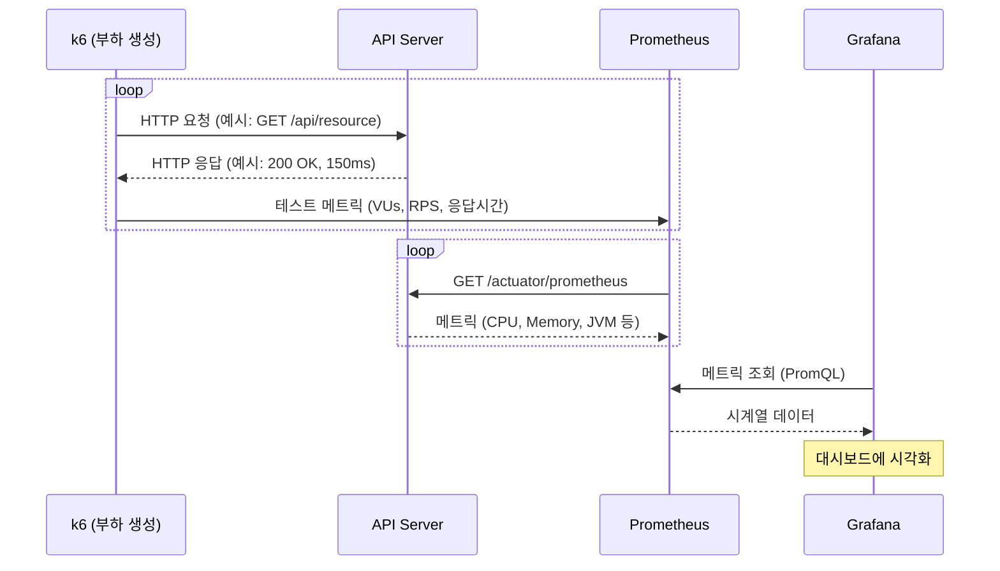

## 테스트 결과 요약
**시나리오 기반 부하 테스트(VU 70) 기준**
- `group_duration 평균 응답 시간` 361ms → 117ms **(-67.50%)**
- `group_duration p95 응답 시간` 1.26s → 415ms **(-67.05%)**

**병목**: 서버 HikariCP Waiting 증가(커넥션 대기)로 요청 지연 발생

**해결**: 조회 패턴 기반 복합 인덱스 + Full-Text 인덱스 적용

---

### 테스트 대상 서버
- Server: AWS EC2 Free Tier (CPU 1 vCPU, Memory 1GB, Swap 2GB)
- DB/커넥션 설정
    - `max_connections=20`
        - API 서버 HikariCP maximum_pool_size = 5
    - `innodb_buffer_pool_size=128M` (1GB RAM 환경에서 App과 메모리 공유)
- Test Duration: 10분 (2m ramp-up / 6m steady / 2m ramp-down)
- VU: 50 / 70 / 100

---

### 테스트 데이터
- 회원: 300
- 책: 3,000
- 게시글: 30,000
- 채팅방: 회원당 3개 (총 900)
- 채팅 메시지: 20,000

---

### 테스트 시나리오 (User Journey)

k6 시나리오: [`k6/tests/user-journey-test.js`](./k6/tests/user-journey-test.js)
- 로그인 → 내 정보 조회 → 읽지 않은 채팅 메시지 개수 조회 → 
- 게시글 목록 조회 → 게시글 키워드(저자, 책 제목) 검색 → 게시글 상세 조회 → 
- 채팅방 목록 조회 → 채팅방 입장 → 채팅 메시지 전송 (optional)

---

### 개선 사항
1. 자주 조회되는 데이터 테이블의 복합 인덱스 생성
2. 쿼리 개선 : DB 통계(집계) 쿼리 + 프로젝션 사용

<table>
  <thead>
    <tr>
      <th>VU</th>
      <th>개선 전 평균</th>
      <th>개선 후 평균</th>
      <th>평균 변화율</th>
      <th>개선 전 p95</th>
      <th>개선 후 p95</th>
      <th>p95 변화율</th>
    </tr>
  </thead>
  <tbody>
    <tr>
      <td align="right">50</td>
      <td align="right">123ms</td>
      <td align="right">63ms</td>
      <td align="right"><span style="color:#d73a49;"><strong>▼ 48.35%</strong></span></td>
      <td align="right">405ms</td>
      <td align="right">203ms</td>
      <td align="right"><span style="color:#d73a49;"><strong>▼ 49.80%</strong></span></td>
    </tr>
    <tr>
      <td align="right">70</td>
      <td align="right">361ms</td>
      <td align="right">117ms</td>
      <td align="right"><span style="color:#d73a49;"><strong>▼ 67.50%</strong></span></td>
      <td align="right">1.26s</td>
      <td align="right">415ms</td>
      <td align="right"><span style="color:#d73a49;"><strong>▼ 67.05%</strong></span></td>
    </tr>
    <tr>
      <td align="right">100</td>
      <td align="right">1.11s</td>
      <td align="right">552ms</td>
      <td align="right"><span style="color:#d73a49;"><strong>▼ 50.22%</strong></span></td>
      <td align="right">3.61s</td>
      <td align="right">2.78s</td>
      <td align="right"><span style="color:#d73a49;"><strong>▼ 22.99%</strong></span></td>
    </tr>
  </tbody>
</table>

> 테스트는 각 VU(50/70/100) 조건에서 3회 실행 후 중앙값 기준으로 정리

---

## 테스트 도구 및 아키텍처

### 사용 도구
- [k6](https://k6.io/): 부하 생성 도구
- [Prometheus](https://prometheus.io/): 메트릭 수집 및 저장
- [Grafana](https://grafana.com/): 메트릭 시각화



### 데이터 흐름



---

### 사전 요구사항

- Docker & Docker Compose
- k6

### EC2 보안 그룹 설정

로컬에서 EC2의 Actuator 엔드포인트에 접근하려면 보안 그룹에 인바운드 규칙 추가 필요

| 타입 | 프로토콜 | 포트 | 소스 | 설명 |
|------|----------|------|------|------|
| Custom TCP | TCP | 8081 | 내 IP | 운영 서버 Actuator 접근 |
| Custom TCP | TCP | 8083 | 내 IP | 개발 서버 Actuator 접근 |


## 프로젝트 구조

```
BOB-perf/
├── .env                        # 환경변수 설정
│
├── k6/
│   ├── tests/                  # k6 테스트 스크립트
│   │   └── user-journey-test.js
│   └── scripts/                # k6 실행 스크립트
│
└── monitoring/                 # Prometheus, Grafana 설정
    ├── prometheus/
    │   └── prometheus.yml.template
    │   
    └── grafana/
        └── provisioning/
            ├── dashboards/
            │   └── dashboard.yml
            └── datasources/
                └── prometheus.yml
```
