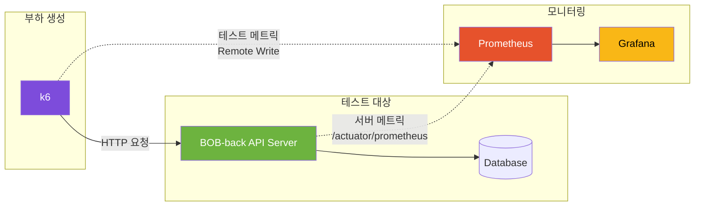
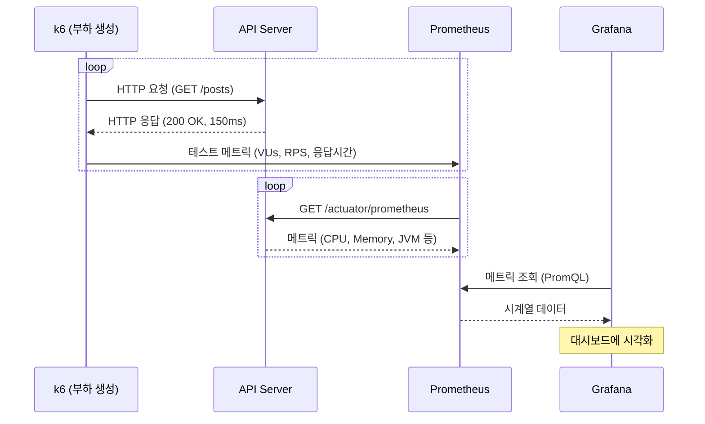
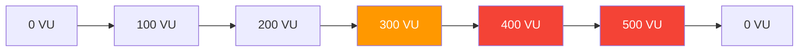

### 테스트 대상 서버

#### 1. 로컬 서버

| 항목 | 스펙                             |
|------|--------------------------------|
| OS | Windows 11                     |
| CPU | AMD Ryzen 5 7520U (4코어 / 8스레드) |
| Memory | 16GB                           |

#### 2. EC2 서버

| 항목 | 스펙 |
|------|------|
| Instance | t2.micro (프리티어) |
| vCPU | 1 |
| Memory | 1GB |

---

## 테스트 도구 및 아키텍처

### 사용 도구
- [k6](https://k6.io/): 부하 생성 도구
- [Prometheus](https://prometheus.io/): 메트릭 수집 및 저장
- [Grafana](https://grafana.com/): 메트릭 시각화



### 데이터 흐름



---

## 테스트 대상

### BookBridge API 엔드포인트

| API | 메서드 | 엔드포인트 | 설명 | 테스트 목적 |
|-----|--------|-----------|------|-------------|

## 측정 지표

### 핵심 지표 (Golden Signals)

| 지표 | k6 메트릭 | 의미 | 목표값 |
|------|----------|------|--------|
| **응답 시간** | `http_req_duration` | 요청~응답 소요 시간 | p95 < 500ms |
| **에러율** | `http_req_failed` | 실패한 요청 비율 | < 1% |
| **처리량 (RPS)** | `http_reqs` | 초당 처리 요청 수 | > 50 RPS |
| **처리량 (TPS)** | `iterations` | 초당 트랜잭션 수 | 시나리오별 상이 |

---

## 테스트 종류

### Load Test (부하 테스트)

**목적**: 예상 트래픽(300 VU)에서 정상 동작 여부 파악


### Stress Test (스트레스 테스트)

**목적**: 한계 지점(500 VU), 성능 병목 지점 파악



### Soak Test (내구 테스트)

**목적**: 장시간 운영 시 메모리 누수 등 문제 확인


---

### 사전 요구사항

- Docker & Docker Compose
- k6

### 1. EC2 보안 그룹 설정

로컬에서 EC2의 Actuator 엔드포인트에 접근하려면 보안 그룹에 인바운드 규칙 추가 필요

| 타입 | 프로토콜 | 포트 | 소스 | 설명 |
|------|----------|------|------|------|
| Custom TCP | TCP | 8081 | 내 IP | 운영 서버 Actuator 접근 |
| Custom TCP | TCP | 8083 | 내 IP | 개발 서버 Actuator 접근 |


### 3. 실행

```bash
docker-compose up -d
```


### Grafana 대시보드 확인

1. http://localhost:3000 접속 (admin/admin)
2. Dashboards > Spring Boot Performance 선택
3. 실시간 메트릭 확인:
   - TPS (Requests/sec)
   - Response Time (P50, P95)
   - Error Rate
   - JVM Memory/CPU
   - HTTP Status Codes

## 프로젝트 구조

```
BOB-perf/
├── .env                        # 환경변수 설정
│
├── scripts/                    # 실행 스크립트
│   ├── run-k6-test.sh          # k6 실행 (Linux/Mac)
│   └── run-k6-test.ps1         # k6 실행 (Windows)
│
├── k6/
│   ├── config/
│   │   └── thresholds.js       # 성능 임계값 정의
│   └── scripts/                # 테스트 스크립트
│
└── monitoring/                 # Prometheus, Grafana 설정
    ├── prometheus/
    │   └── prometheus.yml
    │   
    └── grafana/
        └── provisioning/
            ├── dashboards/
            │   └── dashboard.yml
            └── datasources/
                └── prometheus.yml
```
